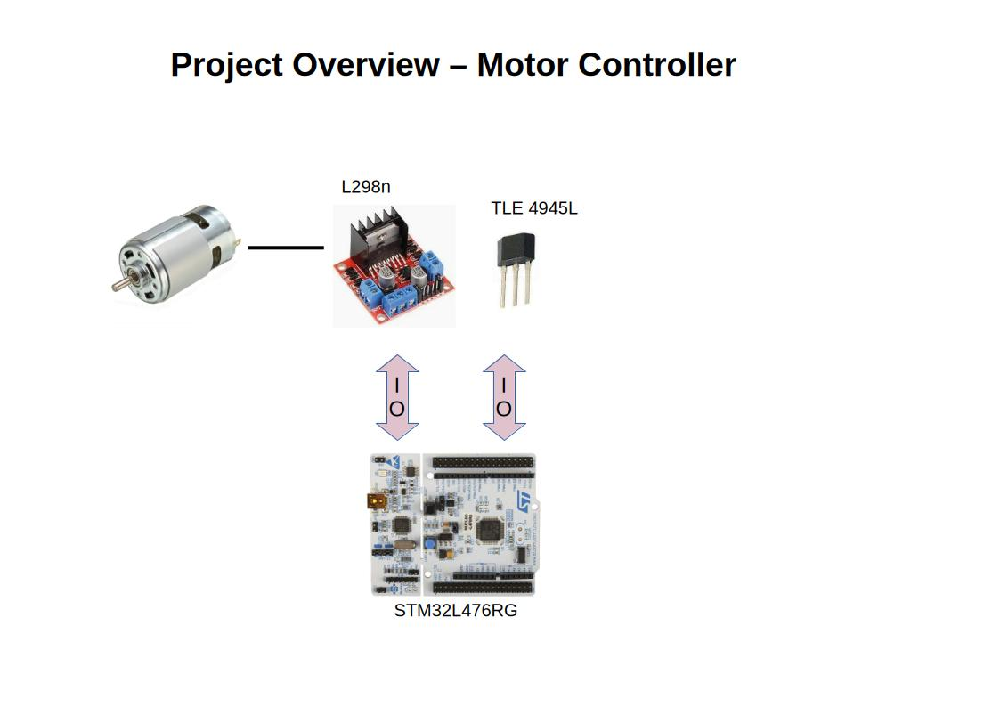
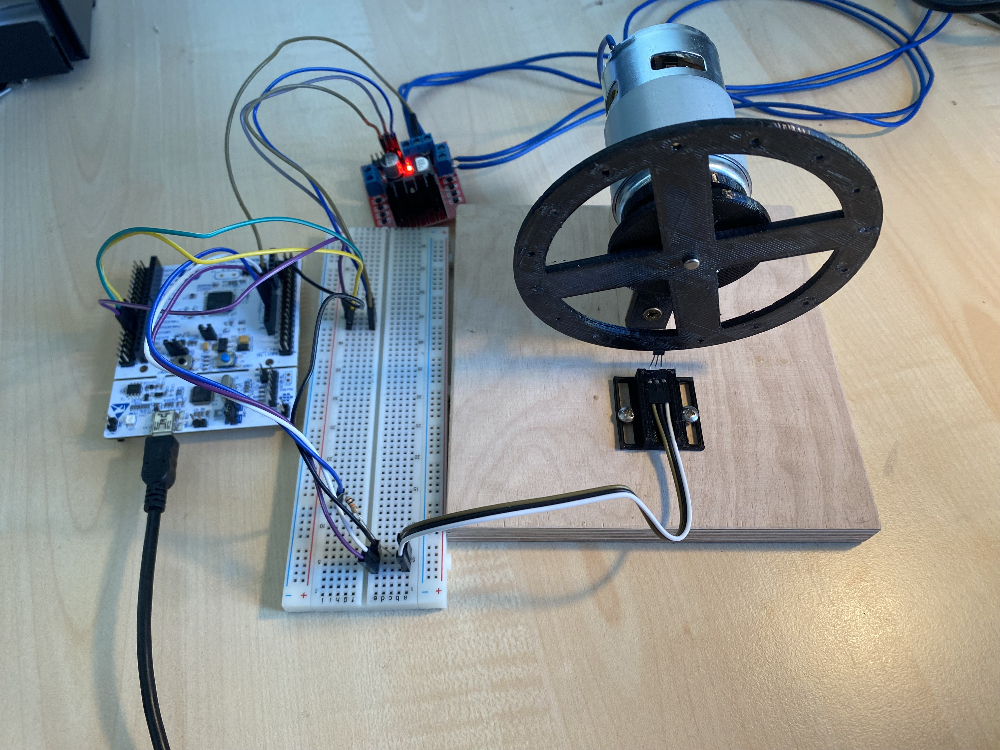

# PI-Controlled DC Motor Driver System

## Description
This project implements a closed-loop DC motor speed controller using a Proportional-Integral (PI) control algorithm. Built in C++ on the STM32 platform, the system dynamically regulates motor velocity based on real-time feedback.

An interrupt-driven Hall effect sensor measures the current motor speed. High-frequency Pulse Width Modulation (PWM) drives the motor power stage. Telemetry data and control commands are continuously streamed via a high-performance USART interface utilizing Direct Memory Access (DMA) to minimize CPU overhead and ensure non-blocking communication.

---

## System Architecture

For a detailed visual overview of the wiring, signal routing, and system architecture, please refer to the diagram below:

### Component Breakdown
* **Microcontroller:**
  * **STM32L465RG Nucleo** 
* **Power & Actuation:**
  * **L298N** 
* **Feedback Mechanism:**
  * **Infineon TLE4945L** 
* **Communication Interface:**
  * **USART with DMA** 

---

